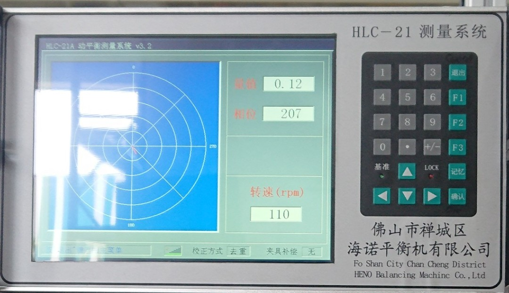
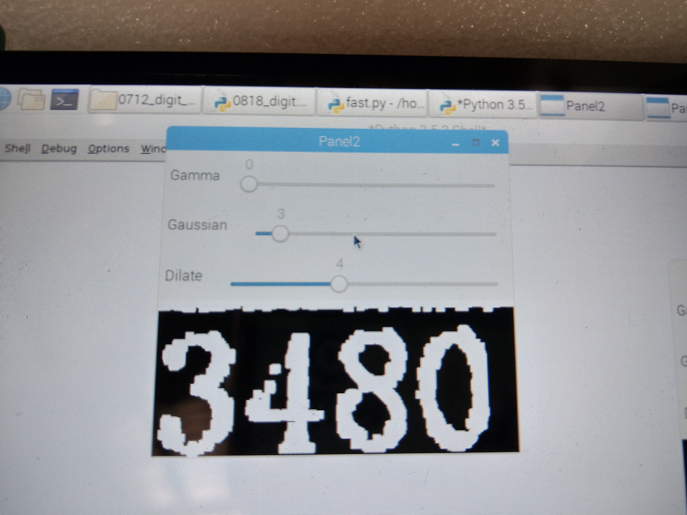
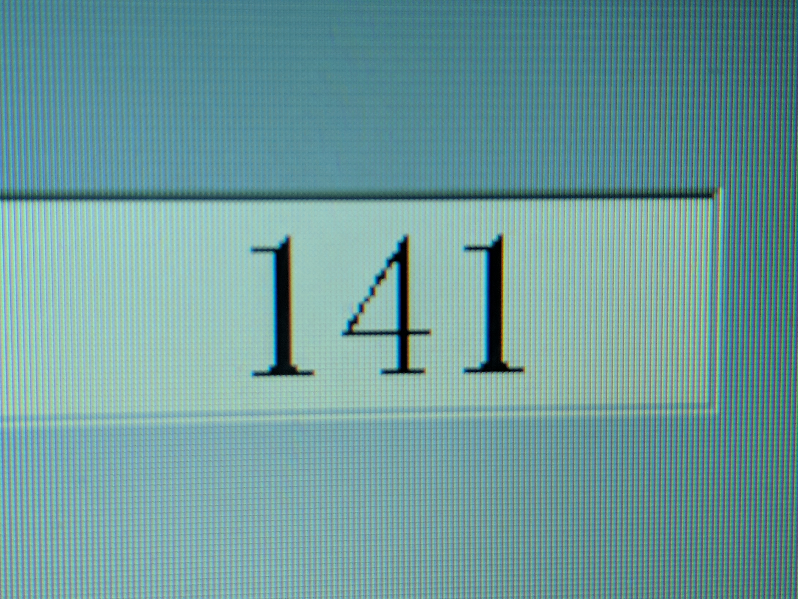
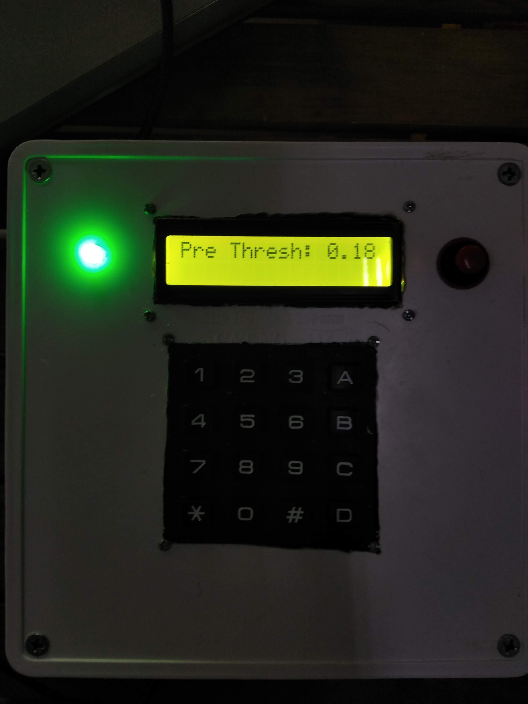
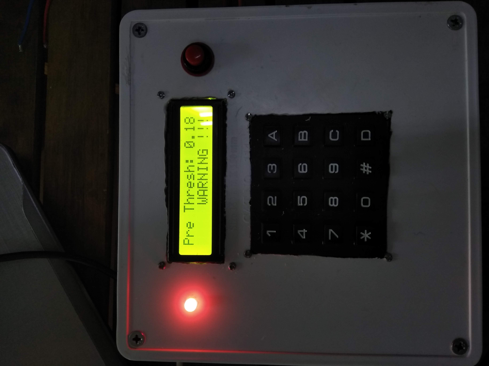
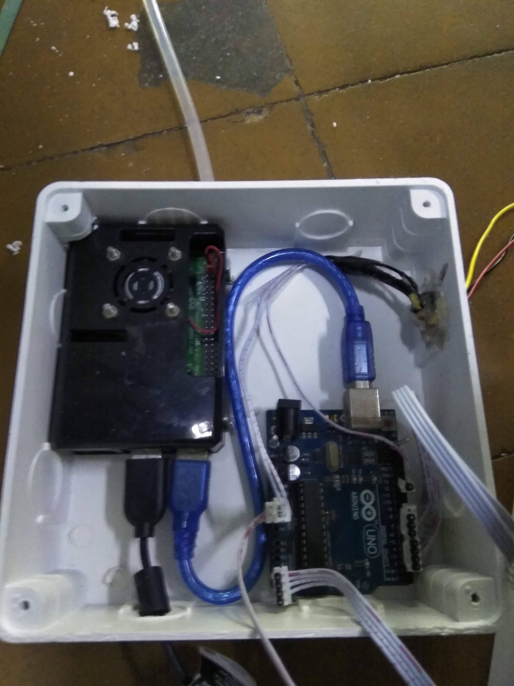
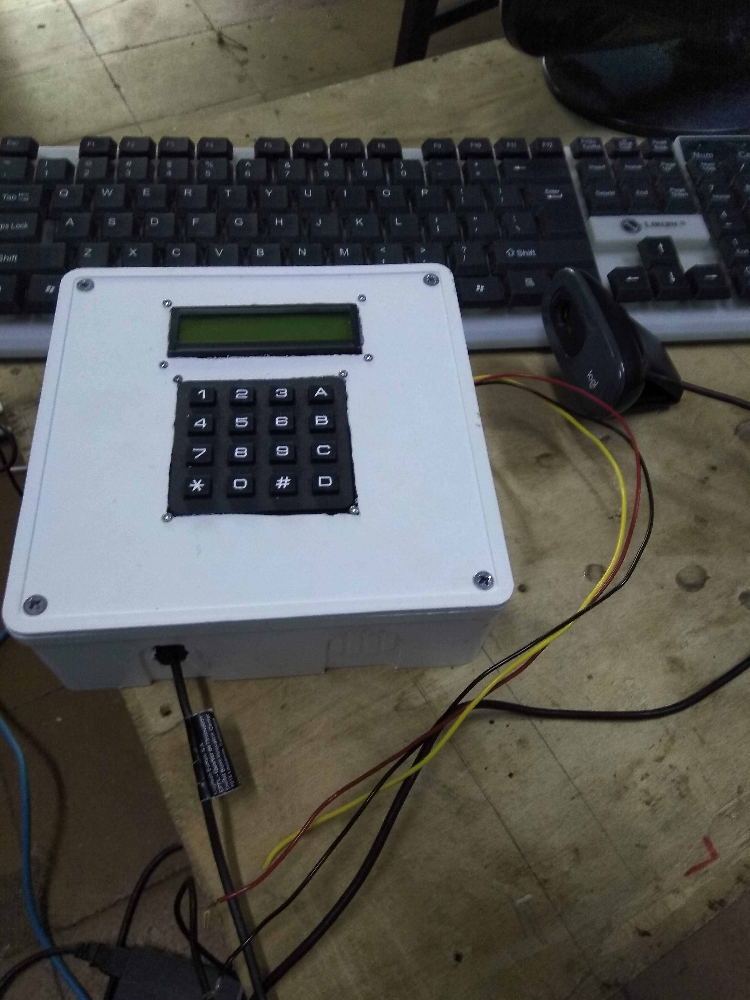

# 7 Segment Digits Recognization Simple KNN Model

## Sumary

- As request of TTI Viet Nam VSIP2

- KNNs algorithm to train 10-digits model

- Implement computer vision with Python on Raspberry Pi 3 (Debian)

- Threading in Python to handle two cameras in parallel for real-time
  responding

- Build PyQT5 linux application to configure image parameters

## Gallery

### Video

### Images

</img>
</img>
</img>
</img>
</img>
</img>
</img>
</img>

## Contributors

1. Nguyễn Minh Tiến Nguyễn Minh Tiến - [Facebook](https://www.facebook.com/spiderock98) | [Telegram](https://t.me/spiderock98) | [Instagram](https://www.instagram.com/spiderock98/) | [YouTube](https://www.youtube.com/channel/UCKtd98ra9ovo2HW4_UFC9Cw/videos)
2. Phạm Chí Tâm - [Facebook](https://www.facebook.com/profile.php?id=100007889464843)
3. Lê Trung Phương - [Facebook](https://www.facebook.com/le.phuong.ltp)

